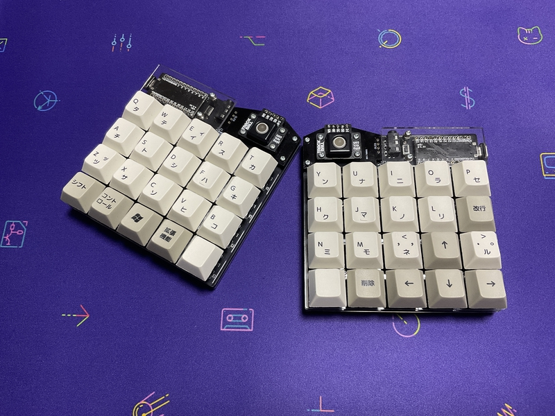

# cool644
  

# What is cool644?

 
cool644 is 40% keyboards.
 
cool644 is an evolution of cool640.
 
The cool644 can use rotary encoders and trackballs.
 
cool640 is written here.https://github.com/telzo2000/cool640
